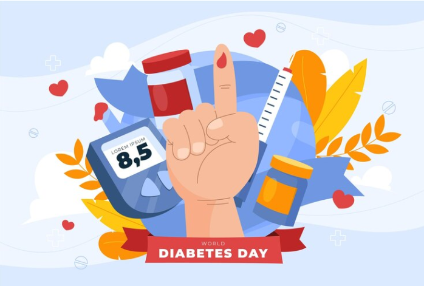

# Diabetes Prediction Capstone project.



This is the capstone project 1 for the Machine Learning Zoomcamp 2023.

## Table of Contents
- [Diabetes Prediction Capstone project.](#diabetes-prediction-capstone-project)
  - [Table of Contents](#table-of-contents)
  - [Project Overview](#project-overview)
  - [Datasets](#datasets)
  - [Dependencies](#dependencies)
  - [Workflow](#workflow)
    - [1. Cloning the repository:](#1-cloning-the-repository)
    - [2. **Setting up the environment:**](#2-setting-up-the-environment)
    - [3. Running `notebooks/EDA + Model_Training1.ipynb`](#3-running-notebookseda--model_training1ipynb)
    - [4. Training model](#4-training-model)
    - [5. Making predictions](#5-making-predictions)
    - [6. Containerizing the model](#6-containerizing-the-model)
  - [Directory structure](#directory-structure)
  - [Contributors](#contributors)
  - [License](#license)
  - [Acknowledgments](#acknowledgments)

---

## [Project Overview](#project-overview)

In a transition to a preventive health system, being able to identify risk of diabetes to implement an early warning system and also a preventive health campaign is paramount. There is a classical curative approach using clinical exams only when the symptoms of diabetes appear. Being able to implement it from non-intrusive measures based on behavioral risk factors carried on as part of a surveillance system might lead to reduce post-sickness attentional demand and those cost associated leading to a cost-effective and more humain health system. The objective of this capstone project is to be able to predict the probability and an early-warning risk alert based on the available dataset.


## [Datasets](#datasets)

The Behavioral Risk Factor Surveillance System (BRFSS) is an ongoing, state-based telephone survey that collects data about health-related risk behaviors, chronic health conditions, and the use of preventive services among adults aged 18 years and older residing in the United States. Conducted annually by the Centers for Disease Control and Prevention (CDC), the BRFSS has been providing valuable insights into the health status and behaviors of U.S. adults since its inception in 1984.

The most relevant fields in the dataset and whose descriptors are in the data dictionary are:

- DIABETE4: Diabetes Awareness
- _RFHYPE6: High Blood Pressure Awareness ("yes" or "no")
- TOLDHI3: Cholesterol Awareness ("yes" or "no")
- _CHOLCH3: Cholesterol check within past five years ("yes" or "no")
- _BMI5: Body mass index (scale)
- SMOKE100: Smoked at Least 100 Cigarettes ("yes" or "no")
- CVDSTRK3: Chronic Health Conditions ("yes" or "no")
- _MICHD: Ever had CHD or MI (Coronary Heart Disease (CHD) and Myocardial Infarction (MI)) ("yes" or "no")
- _TOTINDA: Leisure Time Physical Activity
- _FRTLT1A: Consume Fruit 1 or more per day ("yes" or "no")
- _VEGLT1A: Consume Vegetables 1 or more per day ("yes" or "no")
- _RFDRHV7: Heavy Alcohol Consumption ("yes" or "no")
- _HLTHPLN: Have any health insurance ("yes" or "no")
- MEDCOST1: Could Not Afford To See Doctor ("yes" or "no")
- GENHLTH: General health status ("excellent", "very good", "good", "fair", "poor")
- MENTHLTH: Number of Days Mental Health is Not Good (scale based on the amount of days)
- PHYSHLTH: Number of Days Physical Health is Not Good (scale based on the amount of days)
- DIFFWALK: Difficulty walking or climbing stairs ("yes" or "no")
- _SEX: Gender ("male", "female")
- _AGEG5YR: Age group (5-year intervals)
- EDUCA: Highest level of education attained
- INCOME3: Family income (11 categories)

The CDC BRFSS Survey 2021, can be found on Kaggle Datsets [CDC BRFSS Survey 2021](https://www.kaggle.com/datasets/dariushbahrami/cdc-brfss-survey-2021). All the dataset files can be downloaded and decompressed from there and stored in the ./data folder for reproducibility of this project.

The CDC BRFSS Survey 2021 codebook with a detailed dictionary of its variables, description and codification, can be found on Kaggle Datsets [CDC BRFSS Survey CODEBOOK](https://www.cdc.gov/brfss/annual_data/2021/pdf/codebook21_llcp-v2-508.pdf). To learn more about the data, you can go to the official page [Centers for Disease Control and Prevention, 2021 BRFSS Survey Data and Documentation](https://www.cdc.gov/brfss/annual_data/annual_2021.html)

## [Dependencies](#dependencies)

The project requires the following dependencies to be installed:

```
pipenv
Docker
```

## [Workflow](#workflow)

To run this project locally, follow these steps:

### 1. Cloning the repository: 


```
git clone https://github.com/LEONOB2014/diabetes-prediction
```


### 2. **Setting up the environment:**

The easiest way to set up the environment is to use [Docker](https://www.docker.com/). I used **pipenv** to isolate the environment and reference the required dependencies to run not only the training and testing the model, but also to be able to run the full EDA and model experimantation jupyter notebooks. to run locally just:

```
pip install pipenv
pipenv shell
```

### 3. Running `notebooks/EDA + Model_Training1.ipynb`

This notebook outlines the entire investigation and consists of the following steps [🚨 Skip this step, if you want to directly want to use the final configuration for training and/or final model for predictions]:

- Data loading
- Data cleaning and preparation
- Exploratory data analysis
- Missing Values and imputation.
- Correlation Analysis and identification of non informative features.
- Feature Engineering
- Mutual information
- Setting up a validation framwork and data splitting
- Model Training and evaluation [experimentation and hyper-parameter tuning]
- Saving the trained models [in the [models](../models) directory]
- Making predictions using the saved model
- Testing Flask framework

### 4. Training model

In the deployable model selection I have to take into account that the original CDC BRFSS Survey 2021 stored in Kaggle is not raw survey data, but instead a processed data in which new variables are derived from the original, so many others are results of grouping of other features and a lot of non-informative variables. In light of the EDA and refactored to be able to use the model on demand and based on some objective selected variables it was decided to deploy the model based on relevant features over a subset of features. It is expected that in deployment you could survey the specific variables to make use of this model.

I encoded our best model (GradientBoostingClassifier) inside the `scripts/train.py` file which can be run using:
```
python ./src/train.py
```

The output of this script, which includes the model, can be found in: `models/model_gbc2.pkl`. It has an accuracy of **0.75**. This is the model uses to make predictions in the next steps.

### 5. Making predictions

I have written a Flask code for serving the model by exposing the port:9696, which can be run using:

```
python ./src/serving_diabetes.py
```
or `gunicorn` as:
```
cd scr
gunicorn --bind 0.0.0.0:9696 predict:app
```

We can use this to make an example prediction on the appointment:

```
patient = {'HighBP': 1.0,
            'HighChol': 1.0,
            'CholCheck': 1.0,
            'BMI': 35.0,
            'Smoker': 0.0,
            'Stroke': 0.0,
            'HeartDiseaseorAttack': 0.0,
            'PhysActivity': 1.0,
            'Fruits': 0.0,
            'Veggies': 1.0,
            'HvyAlcoholConsump': 1.0,
            'AnyHealthcare': 1.0,
            'NoDocbcCost': 0.0,
            'GenHlth': 2.0,
            'MentHlth': 0.0,
            'PhysHlth': 0.0,
            'DiffWalk': 0.0,
            'Sex': 1.0,
            'Age': 5.0,
            'Education': 4.0,
            'Income': 9.0
 }
```

using the command:

```
python ./src/test_service.py
# {'diabetes_probability': 0.661813345123, 'diabetes_intervention': True}
```

This gives us a `diabetes_intervention` class [0 or 1] as well as a probability of diabetes.

🚨 Always remember to `conda activate ml-zoomcamp` whenever opening a new terminal/tab.

### 6. Containerizing the model

Run the `Dockerfile` using [make sure that the docker daemon is running?] to build the image `diabetes-prediction`:

```
docker build -t diabetes-prediction .
```

We can access the docker container via the terminal using:
```
docker run -it --rm --entrypoint=bash diabetes-prediction
```

Once the image is built, we need to expose the container port (9696) to the localhost port (9696) using:

```
docker run -it --rm -p 9696:9696 diabetes-prediction
```

We can now make a request in exactly the same way as Step 5:

```
cd scripts
python predict-test.py
# {'no_show': False, 'no_show_probability': 0.2880257379453167}
```


## [Directory structure](#dirctory-structure)
```bash
.
├── data
│   ├── codebook21_llcp-v2-508.pdf
│   ├── df_train.csv
│   └── LLCP2021.csv
├── Dockerfile
├── LICENSE
├── media
│   ├── DIABETE4.png
│   ├── diabetes_day.png
│   └── Screenshot from 2023-12-20 16-39-52.png
├── models
│   ├── model_gbc2.pkl
│   ├── model_gbc.pkl
│   ├── model_rf.pkl
│   └── xgboost_model.xgb
├── notebooks
│   ├── EDA + Model_Training1.ipynb
│   ├── heatmap.png
│   └── Model_training2_reduced_dataset.ipynb
├── Pipfile
├── Pipfile.lock
├── Readme.md
└── src
    ├── predict.py
    ├── serving_diabetes.py
    ├── test_service.py
    └── train.py

```

## [Contributors](#contributors)
Andrés L. Becerra, <aleonardobecerragmail.com>

## [License](#license)
This project is licensed under the [MIT License](./LICENSE).

## [Acknowledgments](#acknowledgments)
* [Alexey Grigorev](https://github.com/alexeygrigorev)
* [DataTalks.Club](https://datatalks.club/)